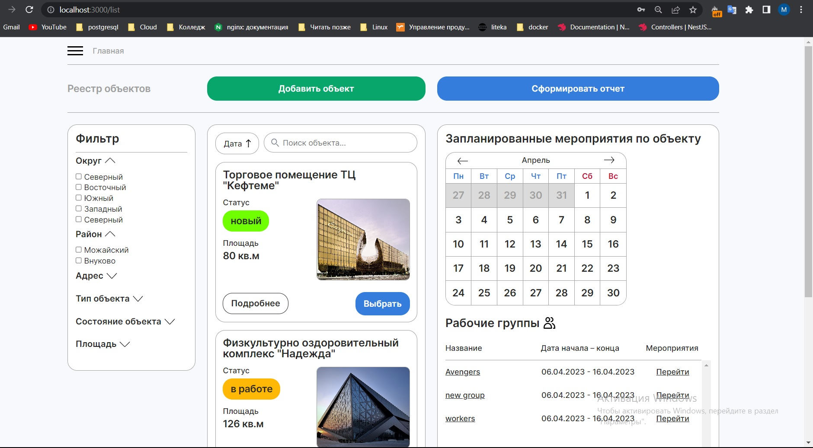
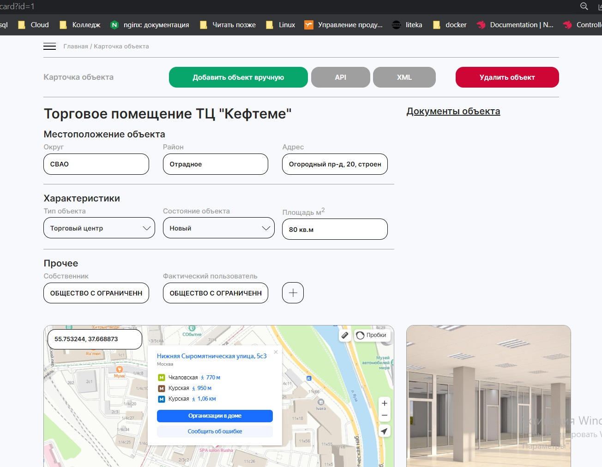

<p align="center">
  
</p>
<p align="center">
  
</p>

## О проекте

[Проект](https://app.izumra.ru/) Данный проект является продуктом команды "Кефтеме" на хакатон "Optimize & Organize Challenge" от платформы Codenrock. Задачей данного хакатона являлась разработка сервиса для удобного взаимодействия сотрудников государственной инспекции недвижимости по городу Москва. 

## Данные для входа

Логин - +79871910894
Пароль - Izumra17.

## Установка

```bash
$ git clone https://github.com/Izumra/Hack_server.git
```

## Запуск приложения локально
Предварительно должен быть установлен Docker на локальной машине

```bash
$ cd Hack_server

$ docker compose up

```
